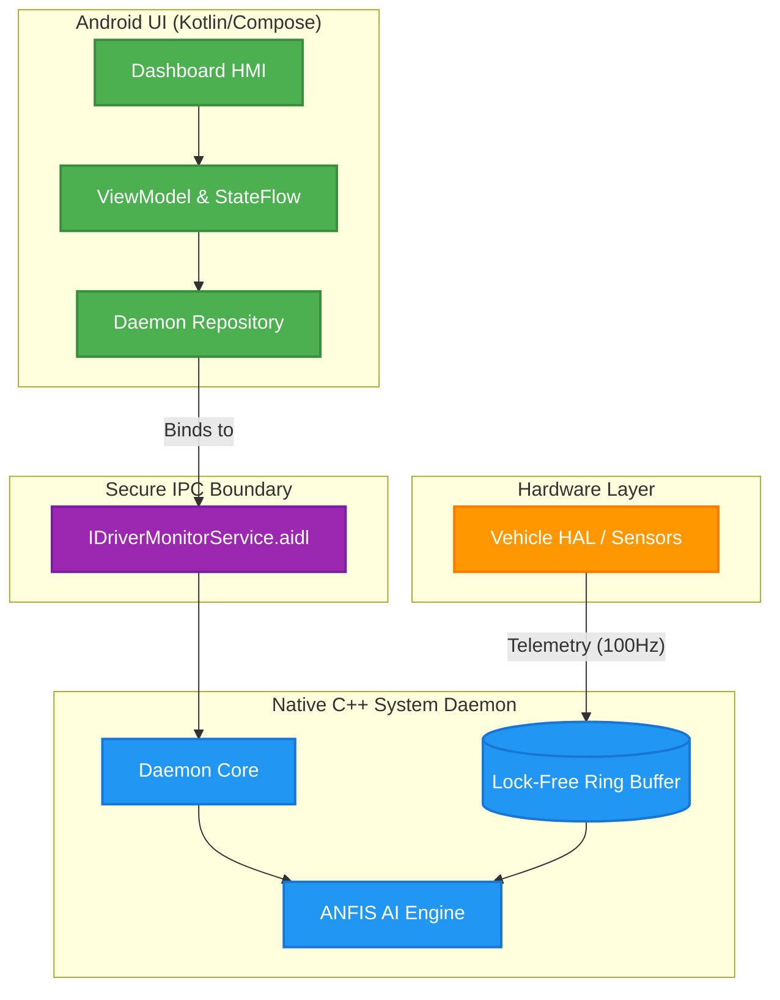

# SmartDrive Monitor for Android Automotive OS (AAOS)

SmartDrive Monitor is an advanced, production-grade Android Automotive OS application designed to evaluate driver behavior in real-time. It leverages a custom **Adaptive Neuro-Fuzzy Inference System (ANFIS)** running in an isolated C++ daemon to process vehicle telemetry data and provide explainable AI (XAI) insights directly to the driver dashboard.

## 🚀 Key Features

*   **Isolated Native Daemon Architecture**: Inference logic is decoupled from the UI. A standalone C++ system daemon handles high-frequency data ingestion and fuzzy logic processing, ensuring zero UI stutter and true process isolation.
*   **ANFIS Engine (C++)**: Real-time fuzzy logic inference engine written in C++ that categorizes driving behavior (Normal, Sudden Acceleration, Hard Braking, Sharp Turn) based on raw vehicle sensors (Speed, RPM, Steering Angle, Brake).
*   **Secure AIDL IPC**: Communication between the UI application and the native C++ daemon is facilitated through highly secure, signature-protected AIDL (Android Interface Definition Language) interfaces.
*   **Explainable AI (XAI) Dashboard**: A modern, reactive Jetpack Compose HMI (Human-Machine Interface) that not only shows the driver's safety score but *explains* the dominant rule that triggered a specific behavior classification.
*   **Hardware Abstraction Layer (VHAL) Integration**: Designed to ingest data directly from Android's Vehicle HAL. Includes Python utilities for UDP-based VHAL telemetry injection and replay testing.

## 🏗️ System Architecture

The system is built with automotive-grade engineering principles, strictly separating the HMI from the core logic:

1.  **Vehicle HAL (VHAL) / Data Replay**: Injects CAN bus telemetry data (Speed, RPM, Steering) via UDP.
2.  **`driver_monitor` Daemon (C++)**: An isolated system process spawned by Android's `init` system. It catches the telemetry, processes it through the ANFIS engine using an lock-free Ring Buffer, and broadcasts state updates.
3.  **AIDL Interface**: The secure bridge. The Daemon exposes an `IDriverMonitorService` that the Android app binds to.
4.  **Android App (Kotlin/Compose)**: The foreground HMI. Utilizes Dagger Hilt for dependency injection, Kotlin StateFlow for reactive UI updates, and Jetpack Compose for rendering the dashboard at 60fps.

## 🛠️ Technology Stack

*   **UI/App Layer**: Kotlin, Jetpack Compose, Coroutines/StateFlow, Dagger Hilt, MVVM.
*   **Core/Daemon Layer**: C++17, CMake, Android NDK.
*   **Inter-Process Communication**: AIDL, Android Binder.
*   **System Integration**: Android `init.rc` scripting, Android Automotive OS (AAOS) permissions.
*   **Testing/Simulation**: Python (Socket programming for VHAL simulation).

## ⚙️ Building & Running

### Prerequisites
*   Android Studio Ladybug (or newer)
*   Android NDK and CMake installed via SDK Manager
*   An Android Automotive OS Emulator (or physical head unit)

### Build Instructions
1. Clone the repository.
2. Open the project in Android Studio.
3. Sync Gradle and ensure the NDK builds the C++ daemon successfully.
4. Run the application `assembleDebug` task.

*(Note: Deploying the native daemon executable requires root access on the target emulator/device to push to `/system/bin/` and configure `init.rc` services).*

## 🛡️ Security

The AIDL communication is guarded by a custom signature-level permission (`com.smartcabin.permission.BIND_DRIVER_MONITOR`). Only applications signed with the same certificate as the daemon wrapper can bind to the telemetry service, preventing malicious third-party apps from intercepting sensitive driver data.
